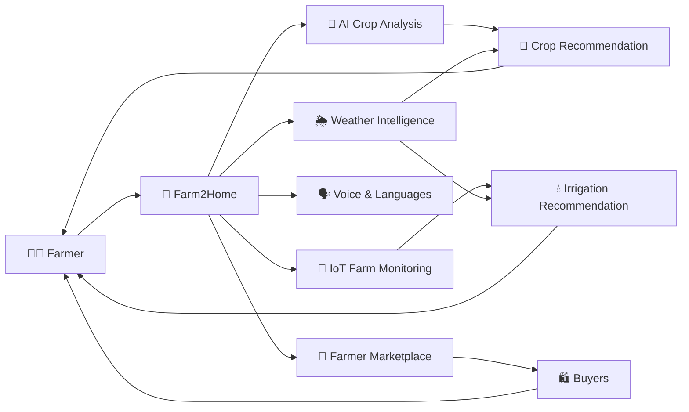

# 🌾 Farm2Home

> **An AI + IoT powered smart agriculture platform connecting farmers with intelligent crop insights, real-time farm monitoring, and direct markets.**

<p align="center">
  
  
  
  
</p>

---

## 🚜 What is Farm2Home?

**Farm2Home** is a unified digital agriculture ecosystem designed to help farmers make **smarter, faster, and more informed farming decisions**.

The platform brings together:

* 🤖 **Artificial Intelligence** for crop and disease analysis
* 🌱 **Crop Management** for personalized farming guidance
* 📡 **IoT Monitoring** for real-time field conditions
* 💧 **Smart Irrigation** for efficient water usage
* 🌦️ **Weather Intelligence** for better farm decisions
* 🛒 **Direct Marketplace** for selling agricultural products
* 🗣️ **Multilingual & Voice Assistance** for easier accessibility

> **One platform. One connected ecosystem. Smarter farming. 🌾**

---

## ✨ Key Features

### 🤖 AI-Powered Crop Intelligence

Farmers can upload **crop or leaf images** and use AI-based analysis to identify potential:

* 🦠 Plant diseases
* 🐛 Pest infestations
* 🌿 Crop health issues

The system can then provide **crop-protection recommendations and farming guidance** to help farmers take appropriate action.

---

### 🌱 Smart Crop Management

Get personalized agricultural guidance based on the farmer's:

* 🌾 Crop type
* 📍 Field conditions
* 🌦️ Weather information
* 📅 Crop growth stage
* 💧 Water requirements

The platform can assist with:

**Fertilizers • Crop Care • Pest Management • Irrigation • General Farming Practices**

---

### 📡 IoT-Based Farm Monitoring

Farm2Home can integrate with agricultural IoT sensors to continuously monitor field conditions.

| Sensor           | Monitoring              |
| ---------------- | ----------------------- |
| 💧 Soil Moisture | Soil water availability |
| 🌡️ Temperature  | Field temperature       |
| 💨 Humidity      | Environmental humidity  |
| 🚰 Water Level   | Available water level   |

Sensor data can be combined with **crop requirements and weather information** to generate more informed irrigation recommendations.

---

### 💧 Smart Irrigation

Water is one of the most valuable resources in agriculture.

Farm2Home uses:

```text
IoT Sensor Data
       +
Crop Requirements
       +
Weather Information
       ↓
Smart Irrigation Recommendation
```

This helps farmers:

* 💧 Avoid unnecessary watering
* 🌱 Maintain suitable soil moisture
* 📉 Reduce potential water wastage
* 🌾 Make better irrigation decisions

---

### 🛒 Direct Farmer Marketplace

Farmers can directly list their agricultural products on the platform.

Each listing can contain:

```text
🌾 Product
📦 Quantity
💰 Price
📍 Location
📅 Availability
```

Buyers can browse available products and **communicate directly with farmers**, helping improve market accessibility and potentially reduce unnecessary intermediary involvement.

---

### 🗣️ Multilingual & Voice-Based Assistance

Technology should work **for farmers — not the other way around.**

Farm2Home is designed to support:

* 🌐 Regional languages
* 🎙️ Voice-based interaction
* 💬 Natural-language questions
* 🔊 Accessible agricultural recommendations

Farmers can interact with the system in their **preferred language**, reducing dependence on English-centric interfaces.

---

## 🧠 How It Works



---

## 🔄 Platform Ecosystem

```text
                 🌾 Farm2Home
                         │
       ┌─────────────────┼─────────────────┐
       │                 │                 │
       ▼                 ▼                 ▼
   🤖 AI ENGINE       📡 IoT SYSTEM     🛒 MARKETPLACE
       │                 │                 │
       ▼                 ▼                 ▼
  Crop Analysis      Field Data       Product Listing
  Disease Detection  Soil Moisture    Price
  Pest Detection     Temperature      Quantity
  Recommendations    Humidity         Location
       │                 │                 │
       └────────────┬────┴─────────────────┘
                    ▼
             👨‍🌾 FARMER
                    │
                    ▼
          🗣️ MULTILINGUAL ASSISTANT
                    │
                    ▼
          📈 BETTER FARM DECISIONS
```

---

## 🎯 Our Goal

The goal of **Farm2Home** is to create a simple and accessible digital ecosystem where farmers can access multiple agricultural services from a single platform.

### We aim to help farmers:

> 🌱 **Grow smarter**
> 💧 **Use resources efficiently**
> 🤖 **Leverage AI-powered insights**
> 📡 **Monitor their farms remotely**
> 🛒 **Reach potential buyers directly**
> 🗣️ **Access technology in their preferred language**

---

## 🌍 Why Farm2Home?

Traditional farming decisions often depend on limited information, delayed assistance, and complex market access.

Farm2Home brings these capabilities together:

| Traditional Challenge             | Farm2Home          |
| --------------------------------- | ---------------------------- |
| ❌ Limited crop information        | 🤖 AI-powered insights       |
| ❌ Manual field monitoring         | 📡 IoT monitoring            |
| ❌ Water wastage                   | 💧 Smart irrigation guidance |
| ❌ Difficulty identifying diseases | 🌿 AI image analysis         |
| ❌ Language barriers               | 🗣️ Multilingual assistance  |
| ❌ Limited market access           | 🛒 Direct marketplace        |
| ❌ Scattered agricultural services | 📱 Unified platform          |

---

## 🚀 Vision

> **"Empowering every farmer with intelligent technology, actionable insights, and better access to markets."**

Farm2Home envisions a future where **AI, IoT, voice technology, and digital marketplaces work together to make agriculture more connected, efficient, and accessible.**

---

## 🧩 Core Technologies

```text
🤖 Artificial Intelligence
📷 Image Analysis
📡 Internet of Things
🌦️ Weather Intelligence
🗣️ Natural Language & Voice
🌐 Multilingual Technology
🛒 Digital Marketplace
📊 Real-Time Monitoring
```

---

## 🌾 Farm2Home

**AI × IoT × Agriculture × Language × Marketplace**

<p align="center">

### 🌱 Smarter Decisions. 💧 Smarter Resources. 🛒 Better Market Access.

**Built to connect technology with the people who feed the world.**

</p>

---

<p align="center">
  ⭐ If you find this project interesting, consider giving it a star!
</p>
